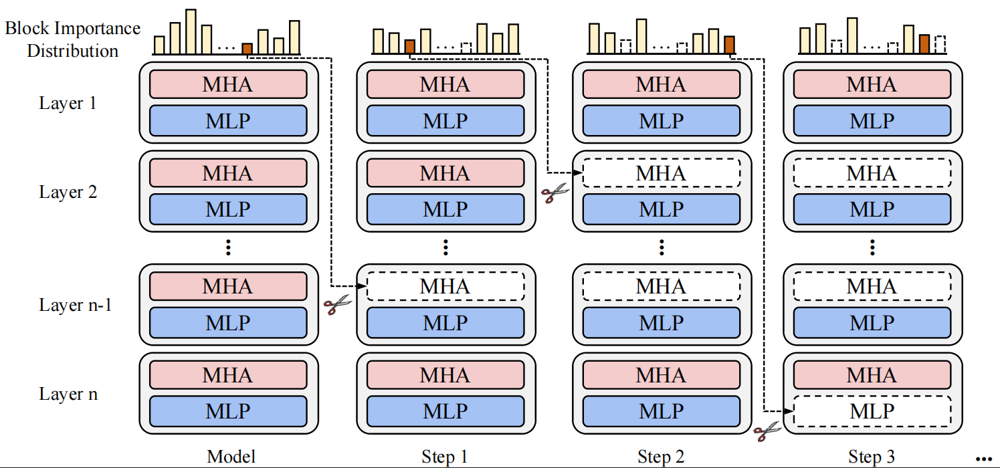
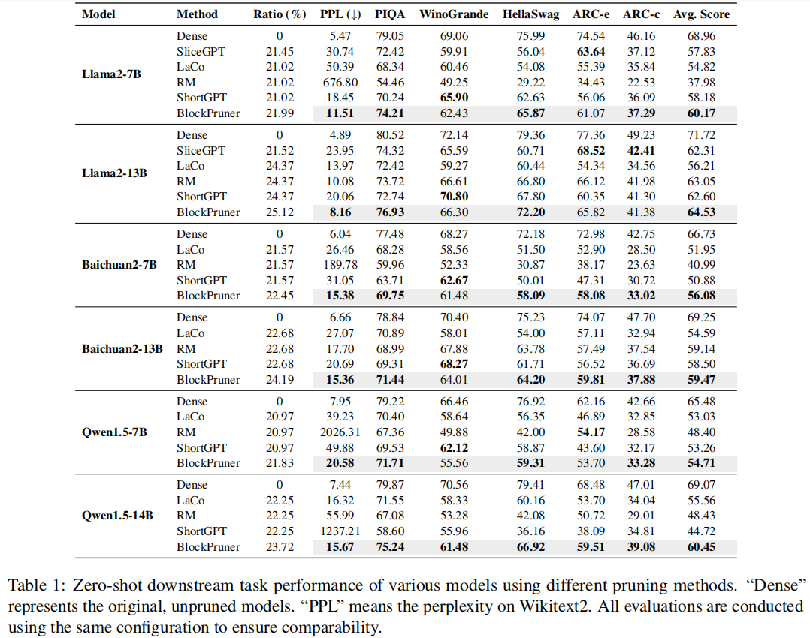

<p align="center" width="100%">
</p>

<div id="top" align="center">

BlockPruner: Fine-grained Pruning for Large Language Models | ACL 2025 Findings
-----------------------------
<!-- **Authors:** -->
_**Longguang Zhong, Fanqi Wan, Ruijun Chen, Xiaojun Quan, Liangzhi Li**_
</div>

## Contents

- [Overview](#overview)
- [Evaluation Results](#evaluation_results)
- [Quick Start](#quick-start)
- [Evaluation](#evaluation)
- [Citation](#citation)

## Overview
In this work, we explored the phenomenon of block redundancy in existing LLMs and proposed a general block pruning framework. It first decomposes each Transformer layer into two minimal residual blocks (MHA or MLP). Then, we use our proposed block importance evaluation metric to assess the importance of each block. Finally, we iteratively prune the block with the lowest importance.
<p align="center">
     <br>
</p>

## Evaluation Results
we experiment with three series of models: [Llama2](https://huggingface.co/collections/meta-llama/llama-2-family-661da1f90a9d678b6f55773b), [Baichuan2](https://huggingface.co/baichuan-inc/Baichuan2-7B-Base), and [Qwen1.5](https://huggingface.co/collections/Qwen/qwen15-65c0a2f577b1ecb76d786524). We employ 7B and 13B models for Llama2 and Baichuan2, respectively, and 7B and 14B models for Qwen1.5. 

Here are the evaluation results.
<p align="center">
     <br>
</p>

## Quick Start
### Setup
To use and evaluate BlockPruner, we have to install the following libraries first:
```shell
torch==2.2.1
lm_eval==0.4.0 # provided in ./lm_eval
```

### Usage
Below is the script for obtaining the pruning sequence of the corresponding model:
```shell
export CUDA_VISIBLE_DEVICES=0

model_name=Llama-2-7b
nsamples=64
dataset=alpaca
block_num=20

python block_search.py \
        --model-path models/${model_name}\
        --block-type mix \
        --cal-nsamples ${nsamples} \
        --del-block-num ${block_num} \
        --cal-dataset ${dataset} \
        --ppl-search-path ppls \
        --ppl-eval-batch-size 2 \
        --device cuda 
```
You can obtain pruning sequences for different types of block by changing `block-type` to `mha`, `mlp`, or `mix`. 

`block-num` represents the maximum number of pruning blocks in the sequence, typically constrained to about one-third of the total number of model blocks. 

`nsamples` indicates the number of samples used for perplexity calculation, with 256 used in our paper.

## Evaluation
We evaluated our pruning algorithm on five benchmarks: PIQA, WingoGrande, HellaSwag, ARC-c, and ARC-e. You can download and install the [official code](https://github.com/EleutherAI/lm-evaluation-harness) or use the version we provide (available in ./lm_eval). Below is our evaluation script:
```shell
export CUDA_VISIBLE_DEVICES=0

model_name=Llama-2-7b
block_num=12
dataset=wikitext2
ppl_search_file=ppls/${model_name}_mix_alpaca_ns_64_del_order_list.json

python eval.py \
        --do-eval \
        --model-path models/${model_name}\
        --del-block-num ${block_num} \
        --cal-dataset ${dataset} \
        --ppl-search-file ${ppl_search_file}\
        --ppl-eval-batch-size 1 \
        --device cuda \
        --compute-dtype bf16 
```
`ppl-search-file` is the pruning sequence file obtained in the previous step.

## Citation
If you find this work relevant to your research or applications, please feel free to cite our work!
```
@article{zhong2024blockpruner,
  title={BlockPruner: Fine-grained Pruning for Large Language Models},
  author={Zhong, Longguang and Wan, Fanqi and Chen, Ruijun and Quan, Xiaojun and Li, Liangzhi},
  journal={arXiv preprint arXiv:2406.10594},
  year={2024}
}
```
